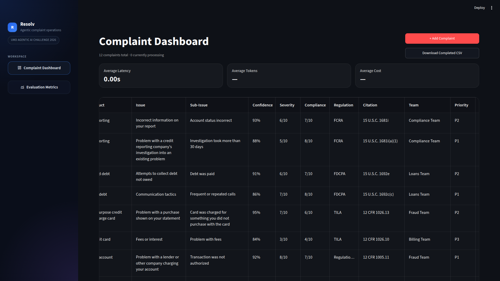
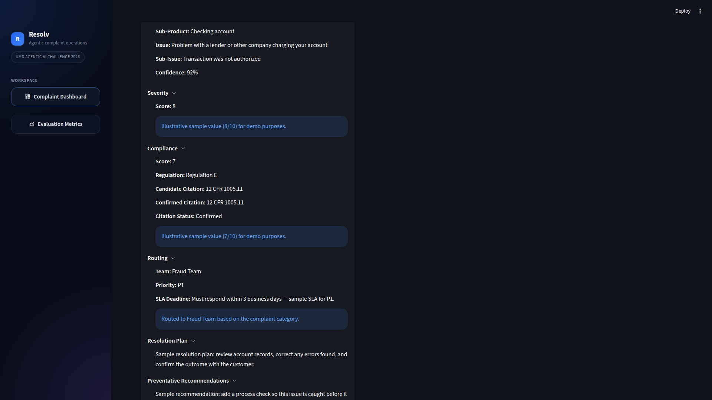

# Resolv: Agentic AI Complaint Triage

**Resolv** is an 8-agent LangGraph pipeline that triages CFPB consumer complaints: it categorizes each complaint, routes it to the right internal team, and verifies compliance risk against CFPB regulations using retrieval-augmented generation (RAG).

**Results:** Placed 3rd of 330 students at Smith's first Agentic AI Challenge. Truist leadership received the solution well and is considering prototyping a similar one in-house.

📣 [Read the LinkedIn post](https://lnkd.in/p/eeGV7Kyw)

## Demo





_Screenshots use the synthetic records in [`sample_data/`](sample_data/sample_complaints.json). They are sample data, not real consumer complaints, and the analysis values shown are illustrative placeholders, not model output. Latency, token, and cost figures are empty because these records were not run through the live pipeline._

## Overview

Resolv is a CFPB complaint triage prototype built for the complaint categorization competition. It classifies complaints, analyzes severity and compliance risk, routes cases to an internal team, generates resolution guidance, drafts a customer email, and exposes the full workflow in a Streamlit dashboard with LangGraph-driven step tracing.

## What It Does

- Validates or corrects complaint taxonomy labels:
  - `product`
  - `sub_product`
  - `issue`
  - `sub_issue`
- Runs parallel analysis for:
  - root cause
  - severity
  - compliance risk
- Retrieves relevant CFPB regulatory context from a Chroma vector index
- Assigns:
  - team
  - priority
  - SLA
- Routes high-risk complaints to human review
- Generates:
  - remediation steps
  - preventative recommendations
  - customer email drafts
- Reviews the customer email in a reflection loop before completion
- Tracks latency, tokens, and cost for complaint runs using LangSmith when configured

## Project Structure

```text
.
├── app/
│   ├── agent_pipeline.py         # LangGraph complaint workflow
│   ├── db.py                     # SQLite persistence
│   ├── langsmith_metrics.py      # LangSmith trace + metrics sync
│   ├── state_store.py            # In-memory/store orchestration for Streamlit
│   ├── streamlit_app.py          # Main dashboard UI
│   ├── taxonomy_helpers.py       # Taxonomy lookups for forms
│   ├── components/
│   │   ├── add_complaint_modal.py
│   │   ├── agent_progress.py
│   │   └── complaint_table.py
│   └── ui/
│       └── icons.py
├── regulation_index/             # Persisted Chroma vector store
├── sample_data/                  # Synthetic demo complaints (not real data)
├── Rules/                        # CFPB regulation XML source files
├── taxonomy.json                 # Complaint taxonomy
├── Test.ipynb                    # Notebook prototype and prompt iteration
├── run_batch_eval.py             # Batch CSV processing script
└── streamlit_app.py              # Root entrypoint for Streamlit
```

## Requirements

- Python `3.11` or `3.12` recommended
- OpenAI API access
- Optional LangSmith project for tracing, token, and cost metrics

The current dependency set is in [requirements.txt](requirements.txt).

## Setup

1. Create and activate a virtual environment.

```bash
python -m venv .venv
source .venv/bin/activate
```

2. Install dependencies.

```bash
python -m pip install -r requirements.txt
```

3. Create your environment file.

```bash
cp .env.example .env
```

4. Fill in the required keys in `.env`.

5. Run the entire [Test.ipynb](Test.ipynb) notebook.

This will:

- download CFPB regulations
- parse the regulation source files
- create the vector database in `regulation_index/` used for RAG processes

## Environment Variables

The app loads environment variables from `.env` inside [app/agent_pipeline.py](app/agent_pipeline.py) and [app/langsmith_metrics.py](app/langsmith_metrics.py).

Required:

- `OPENAI_API_KEY`

Optional but recommended for tracing/metrics:

- `OPENAI_MODEL`
  Defaults to `gpt-5.4-mini` for the main complaint pipeline.
- `OPENAI_COMPLIANCE_MODEL`
  Defaults to `gpt-5.4` and is used only for compliance assessment.
- `OPENAI_EMAIL_MODEL`
  Defaults to `gpt-5.4` and is used only for customer email generation.
- `LANGSMITH_API_KEY`
- `LANGCHAIN_API_KEY`
  If `LANGSMITH_API_KEY` is set, the app will also set `LANGCHAIN_API_KEY` automatically when needed.
- `LANGSMITH_PROJECT`

## Running The App

From the repository root:

```bash
python -m streamlit run streamlit_app.py
```

If you are using the local virtual environment:

```bash
.venv/bin/python -m streamlit run streamlit_app.py
```

The dashboard supports:

- manual complaint entry
- CSV upload from the modal
- complaint detail drill-down
- human review approval/edit flows
- complaint-level LangSmith metrics display

## Batch Processing

Use the batch runner to process a CSV of complaints:

```bash
.venv/bin/python run_batch_eval.py path/to/complaints.csv
```

A sample file is included at [CFPB_Sample.csv](CFPB_Sample.csv) so reviewers can quickly test the agent without preparing their own dataset. This sample data is taken directly from the CFPB website.

The runner now processes complaints in parallel with `4` workers by default.

You can override the worker count:

```bash
.venv/bin/python run_batch_eval.py path/to/complaints.csv --workers 2
.venv/bin/python run_batch_eval.py path/to/complaints.csv --workers 8
```

You can also limit the number of rows:

```bash
.venv/bin/python run_batch_eval.py path/to/complaints.csv --limit 25
```

### Accepted CSV Headers

The app accepts either canonical internal headers:

```text
complaint_id, product, sub_product, issue, sub_issue, narrative
```

or CFPB-style headers:

```text
Complaint ID, Product, Sub-product, Issue, Sub-issue, Consumer complaint narrative
```

## Human Review Flow

When the workflow flags a complaint for review:

- the graph pauses at the human review step
- the dashboard shows review controls
- approval or edit resumes the graph using a durable LangGraph checkpoint

This state is persisted in:

- `complaints.db`
- `langgraph_checkpoints.db`

## Metrics

The app tracks:

- per-agent latency in the timeline
- complaint-level latency, tokens, and cost in the detail view
- dashboard-level average latency, tokens, and cost across complaints

Behavior:

- timeline latency appears after a step completes
- complaint header metrics are populated after LangSmith reconciliation
- local fallback timing is used internally where needed, but final complaint totals prefer LangSmith

## Sample Data

On first run, if `complaints.db` is empty, the dashboard loads 12 synthetic complaints from [sample_data/sample_complaints.json](sample_data/sample_complaints.json) so there is something to explore before you process your own complaints. (The app still needs `OPENAI_API_KEY` set to start.) These are **sample data, not real consumer complaints**: the narratives were written by hand, and the analysis fields (scores, teams, emails) are illustrative placeholders, not model output.

To start with an empty dashboard instead, set `RESOLV_SKIP_SAMPLE_DATA=1`.

## Local Data Files

The app creates and uses these local SQLite files:

- `complaints.db`
- `langgraph_checkpoints.db`

To reset local state:

```bash
rm complaints.db langgraph_checkpoints.db langgraph_checkpoints.db-shm langgraph_checkpoints.db-wal
```

Then restart Streamlit.

## Notes And Caveats

- `regulation_index/chroma.sqlite3` is large and may eventually need Git LFS.
- LangSmith metrics require valid tracing configuration and internet access.
- If LangSmith is unavailable, some token/cost metrics may remain blank.
- The notebook in [Test.ipynb](Test.ipynb) is still the main experimentation surface for prompt iteration.

## Development Notes

Useful entrypoints:

- [app/streamlit_app.py](app/streamlit_app.py)
- [app/agent_pipeline.py](app/agent_pipeline.py)
- [app/state_store.py](app/state_store.py)
- [run_batch_eval.py](run_batch_eval.py)

If you change the taxonomy or regulatory corpus, review:

- [taxonomy.json](taxonomy.json)
- [regulation_index](regulation_index)
- [Rules](Rules)
